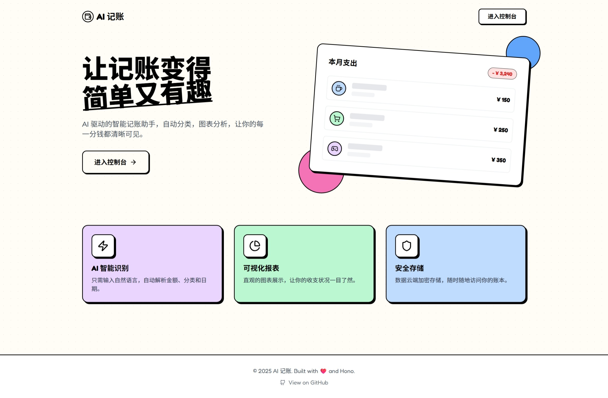

# AI 智能记账本 (AI Smart Accounting)


AI 驱动的智能记账助手，支持自然语言/图片记账、自动分类、图表分析，让每一分钱都清晰可见。



## ✨ 特性 (Features)

-  **AI 智能识别**: 输入自然语言（如“昨天午饭吃了30元”）或上传小票图片，自动解析金额、分类和日期。
-  **PWA 支持**: 可安装到手机桌面，支持离线访问，体验接近原生 App。
-  **数据可视化**: 直观的图表展示收支状况，支持按月/日查看详情。
-  **复古设计**: 独特的 Retro UI 风格，简约而不简单。
-  **安全隐私**: 数据存储在 Cloudflare D1 数据库，GitHub OAuth 安全登录。

## 🛠️ 技术栈 (Tech Stack)

- **前端**: React 19, Vite, Tailwind CSS, Framer Motion, Recharts
- **后端**: Hono.js (运行在 Cloudflare Pages Functions 上)
- **数据库**: Cloudflare D1 (基于 SQLite)
- **ORM**: Drizzle ORM
- **AI**: Zhipu AI (GLM-4-Flash)
- **部署**: Cloudflare Pages

## 🚀 本地开发 (Development)

### 前置要求

- Node.js >= 20
- pnpm
- Wrangler CLI (`npm install -g wrangler`)

### 安装步骤

1. **克隆项目**
   ```bash
   git clone https://github.com/your-username/ai-accounting.git
   cd ai-accounting
   ```

2. **安装依赖**
   ```bash
   pnpm install
   ```

3. **配置环境变量**
   复制 `.dev.vars.example` 为 `.dev.vars` 并填入以下信息：
   ```ini
   GLM_API_KEY=your_zhipu_ai_key
   GITHUB_CLIENT_ID=your_github_client_id
   GITHUB_CLIENT_SECRET=your_github_client_secret
   ```
   > 注意：需要配置 GitHub OAuth App，回调地址设为 `http://yourhost/api/auth/callback` (如果使用 `wrangler pages dev`)

4. **初始化数据库**
   ```bash
   pnpm run db:generate
   pnpm run db:migrate:local
   ```

5. **启动开发服务器**
   ```bash
   pnpm run dev:full
   ```
   访问 `http://localhost:8788` 开始开发。

## 📦 部署 (Deployment)


1. Fork 本仓库。
2. 在 Cloudflare Dashboard 中创建新的 Pages 项目，连接你的 GitHub 仓库。
3. **构建设置**:
   - Framework preset: `Vite`
   - Build command: `pnpm run build`
   - Output directory: `dist`

4. **数据库配置**:
   - 在 Cloudflare Dashboard 创建一个新的 D1 数据库（例如命名为 `ai-accounting-db`）。
   - 获取该数据库的 `database_id`。
   - 修改项目根目录下的 `wrangler.toml` 文件，替换 `database_id` 为你自己的 ID：
     ```toml
     [[d1_databases]]
     binding = "DB"
     database_name = "ai-accounting-db"
     database_id = "YOUR_DATABASE_ID_HERE" # <--- 替换这里
     migrations_dir = "drizzle"
     ```

5. **配置 GitHub Secrets (用于自动部署)**:
   在 GitHub 仓库设置 -> Settings -> Secrets and variables -> Actions 中添加：
   - `CLOUDFLARE_API_TOKEN`: 具备 D1, Pages, Workers 权限的 API Token。
   - `CLOUDFLARE_ACCOUNT_ID`: Cloudflare Account ID。

6. **配置 Pages 环境变量 (用于应用运行)**:
   在 Cloudflare Pages 项目设置 -> Settings -> Environment variables 中添加：
   - `GLM_API_KEY`: 智谱 AI API Key
   - `GITHUB_CLIENT_ID`: GitHub OAuth Client ID
   - `GITHUB_CLIENT_SECRET`: GitHub OAuth Client Secret

7. **绑定 D1 数据库 (Pages Functions)**:
   - 在 Pages 项目设置 -> Functions -> D1 Database Bindings 中，添加绑定：
     - Variable name: `DB`
     - D1 database: 选择你刚才创建的数据库

8. **部署**:
   - 提交代码并推送到 GitHub。
   - GitHub Actions 会自动触发：
     1. 构建前端和后端。
     2. **自动应用数据库迁移** (根据 `wrangler.toml` 配置)。
     3. 部署到 Cloudflare Pages。

## 🤝 贡献 (Contributing)

欢迎提交 Issue 和 Pull Request！

## 📄 许可证 (License)

MIT License
